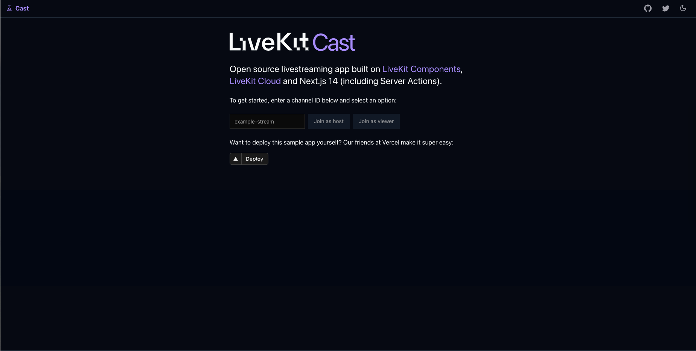

# LiveKit Livestreaming Demo



This is a demo app for livestreaming via RTMP or WHIP using LiveKit. One user is a broadcaster who gets an RTMP/WHIP for streaming (eg, via OBS). Other users can view their stream and chat. We also let you broadcast directly from your device from the "Host" page.

Today most livestreams experience a 5–30 second lag, which is evident in the delay it takes for streamers to respond to chats. Those streams use HLS, which leverages existing CDNs by uploading 5–30 second video chunks, which clients download one chunk at a time. HLS is hugely scalable, but it comes with latency.

LiveKit is a sort of WebRTC CDN, achieving sub-100ms latency for audiences of 1000 or 100,000 by streaming video over backbone Internet connections and only going over the public Internet for the last mile (that is, delivery to connected clients). This enables true real-time, large-scale events, where anyone and everyone can participate.

This sample app only leverages the following technologies:

- [Next.js 14](https://nextjs.org)
- [Tailwind CSS](https://tailwindcss.com)
- [shadcn/ui](https://github.com/shadcn/ui)

## Running locally

Clone the repo and install dependencies:

```bash
git clone git@github.com:livekit-examples/livestream.git
cd livestream
npm install
```

Create a new LiveKit project at <https://cloud.livekit.io>. Then create a new key in your [project settings](https://cloud.livekit.io/projects/p_/settings/keys).

Create a new `.env.development` file and add your new API key and secret as well as your project's WebSocket URL (found at the top of <https://cloud.livekit.io>):

```
LIVEKIT_API_KEY=<your api key>
LIVEKIT_API_SECRET=<your api secret>
LIVEKIT_API_URL=https://<your-project>.livekit.cloud
NEXT_PUBLIC_LIVEKIT_WS_URL=wss://<your-project>.livekit.cloud
```

Then run the development server:

```bash
npm run dev
# or
yarn dev
# or
pnpm dev
# or
bun dev
```

You can test it by opening <http://localhost:3000> in a browser.

## Deploying

This demo is a Next.js app. You can deploy to your Vercel account with one click:

[](https://vercel.com/new/clone?repository-url=https%3A%2F%2Fgithub.com%2Flivekit-examples%2Flivestream&env=LIVEKIT_API_KEY,LIVEKIT_API_SECRET,LIVEKIT_API_URL,NEXT_PUBLIC_LIVEKIT_WS_URL&envDescription=Sign%20up%20for%20an%20account%20at%20https%3A%2F%2Fcloud.livekit.io%20and%20create%20an%20API%20key%20in%20the%20Project%20Settings%20UI)

Refer to the [Next.js deployment documentation](https://nextjs.org/docs/deployment) for more about deploying to a production environment.
